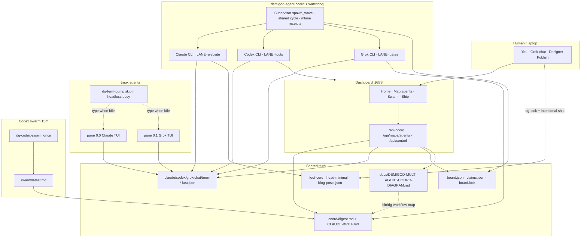
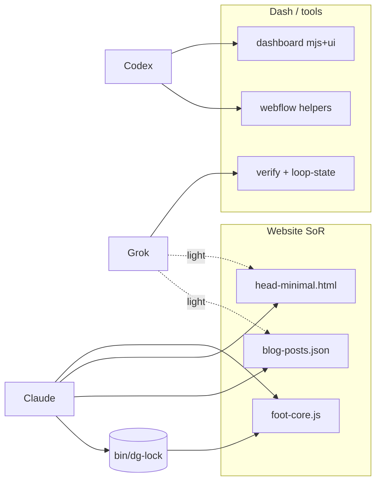
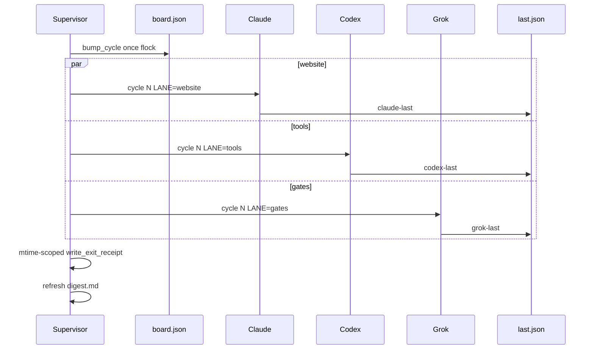
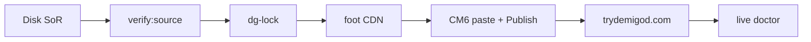

# Demigod — multi-agent coordination workflow

**Updated:** 2026-07-24 · auto via `bin/dg-workflow-map` · review: `/tmp/dg-busy/coord/workflow-map-review.md`  
**Dash:** Map tab → **Agents / coord** · API `/api/maps/agents` · live strip `GET /api/coord`

This is the **current** multi-agent operating model (Claude Code · Codex · Grok · chat · swarm).

---

## Live snapshot (2026-07-24T05:25:44Z)

| Field | Value |
|-------|-------|
| Disk foot | **v818** |
| Board cycle | **175** |
| Claims holds | `{{}}` |
| Swarm last | 2026-07-23T23:32:59Z ok=False |
| Coord service | active |
| Term-pump | off · every 300s |
| Codex swarm timer | off · ~15m |
| Coord watchdog | off |
| Dash :9878 /api/coord | unobservable (fresh host heartbeat) |
| Tick / timeouts | tick=30s · claude=300s · codex=240s · grok=240s |
| spawn_wave + honest receipts | wave=True · mtime receipts=True |

**Recent agent did**

- **claude** ok=True lane=claude:startup-map rebuild integrity: Coordinated with Grok build; it corrected 2 of my stale findings (map JSON is TRACKED; refreshPublic
- **codex** ok=False lane=tools: (empty)
- **grok** ok=True lane=events+gates: Claude idle foot; needHeal claim was stale — public healthy short-melons-push
- **chat**: (no receipt)

---

## 1. Big picture (execution planes)

| Plane | What | How often | Writes |
|-------|------|-----------|--------|
| **Headless coord** | `bin/dg-agent-coord` + **watchdog** timer | tick ~30s; `spawn_wave` when idle | `*-last.json`, board, digest |
| **Interactive term** | tmux `agents` + `bin/dg-term-pump` | every 300s; **skip if headless busy** | `term-*-last.json` |
| **Chat Grok** | interactive chat + **90s** scheduler + **45s** heartbeat | turn / schedule | `chat-last.json`, foot/head (lanes) |
| **Codex swarm assist** | `bin/dg-codex-swarm` + **15m** timer | review P0/P1 | `/tmp/dg-busy/swarm/*` |
| **Dashboard** | `:9878` Map · Home coord strip · `/api/coord` | on demand | display only (tools lane edits dash code) |

Headless **Claude / Codex / Grok** are primary continuous workers. Term + chat are backup / visible. Swarm **reviews** into `latest.md` (does not thrash foot).



---

## 2. Lanes (anti-thrash)

| Agent | Owns | Forbidden | Foot |
|-------|------|-----------|------|
| **Claude** | foot-core, head-minimal, blog-posts.json | dash thrash, auto-DM | `DG_LOCK_OWNER=… bin/dg-lock` |
| **Codex** | agent-dashboard*, webflow helpers, tools | **foot-core** | never |
| **Grok** | verify, loop-state, board honesty, light head/blog | foot without lock | if claim free |
| **Chat / term** | one digest backlog item | redo peer `did` | same as lane |



---

## 3. Supervisor tick (shared cycle + honest receipts)

1. `spawn_wave`: any role idle (not backoff) → **one** `bump_cycle` under `board.lock` flock.
2. Same **cycle id** to every agent spawned in that wave.
3. Snapshot receipt **mtime** before spawn.
4. On exit: keep prior `ok:true` **only if** mtime advanced; else honest `ok:false` (`staleSuccessAvoided`).
5. Fail/timeout → backoff Claude 90s / Codex·Grok 60s.
6. `refresh_digest` rebuilds digest + brief (+ swarm pointer + claims).



---

## 4. Shared filesystem spine

```
/tmp/dg-busy/coord/
  CLAUDE-BRIEF.md · digest.md · board.json · claims.json · board.lock
  claude|codex|grok|chat|term-*-last.json · inbox.jsonl
  workflow-map-last.json · workflow-map-review.md

/tmp/dg-busy/swarm/
  latest.md · assist.md · SYNTHESIS.md · swarm-last.json

/tmp/dg-busy/foot-lock.json   # bin/dg-lock
```

**Dogfood:** `GET /api/coord` → lanes, claims, digest, swarm, diskReady, footNotes.

---

## 5. Website ship path (intentional only)



No auto-DM · no game · no thrash publish. Disk may lead live until deliberate ship.

---

## 6. Commands

| Action | Command |
|--------|---------|
| Coord status | `bin/dg-agent-coord status` |
| Digest | `bin/dg-agent-coord brief` |
| Restart coord | `systemctl --user restart demigod-agent-coord` |
| Term type | `bin/dg-term-type claude/grok "…"` |
| Codex swarm | `bin/dg-codex-swarm once` / `status` |
| **Refresh this diagram** | `bin/dg-workflow-map update` |
| Foot lock | `DG_LOCK_OWNER=me bin/dg-lock …` |
| Verify | `npm run demigod:verify:source` |

**systemd user:** coord · term-pump · codex-swarm.timer · workflow-map.timer · dash · coord-watchdog.timer

---

## 7. Agent turn checklist

1. Read `digest.md` + `swarm/latest.md` if present.
2. Respect **lane** + **claims** + **foot lock**.
3. 1–2 Ponytail wins; do not redo peer `did`.
4. Write `*-last.json` with `lane` + `cycle`.
5. `verify:source` if foot/head; retarget loop-state foot ver.

---

## 8. Last auto-review (2026-07-24T05:25:44Z)

**Problems**
- P2: term-pump inactive — interactive plane offline

**Improvements applied / suggested**
- codex-swarm timer off during codex backoff until 2026-07-28T17:01Z (expected)
- mermaid diagrams ok (4)

---

## 9. Related maps

- Total workflow — `/api/maps/workflow`
- Website architecture — `/api/maps/website`
- Resources — `/api/maps/resources`
- **This map** — `/api/maps/agents` (lanes SoR)
