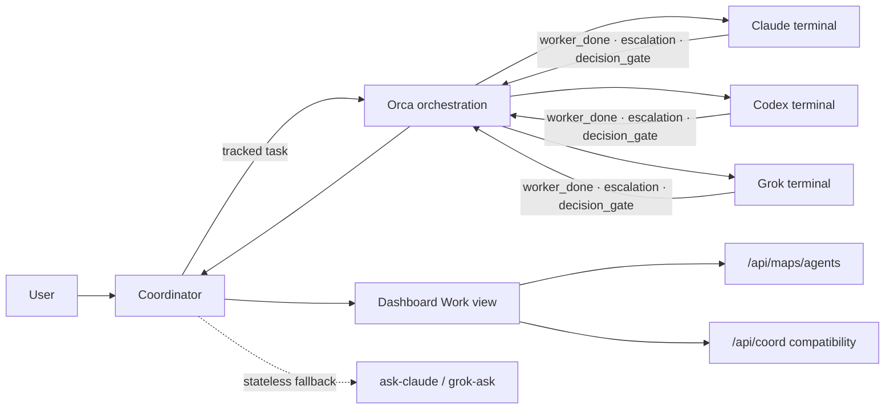

# Demigod — agent coordination

Orca is the single coordination bus for ongoing Claude, Codex, and Grok work.
The dashboard serves this map at `GET /api/maps/agents`; `GET /api/coord` is a
small compatibility view over current work state.

## Runtime truth

- Linux CLI: `orca-ide` (never `/usr/bin/orca`).
- Resolve terminal handles after each Orca restart; do not persist them.
- Use tracked Orca tasks for work with ownership, completion, or escalation.
- Use `ask-claude` or `grok-ask` only for stateless second opinions.
- Dashboard status reads `/tmp/dg-busy/orca-status.json` without shelling out
  from its main poll.
- Files carry durable project truth; Orca messages carry task IDs, paths, and
  concise outcomes.

Coordination does not authorize publishing, outbound messages, forms,
applications, or money movement.

See [`AGENT-COMMS.md`](../AGENT-COMMS.md) for the operating protocol.
