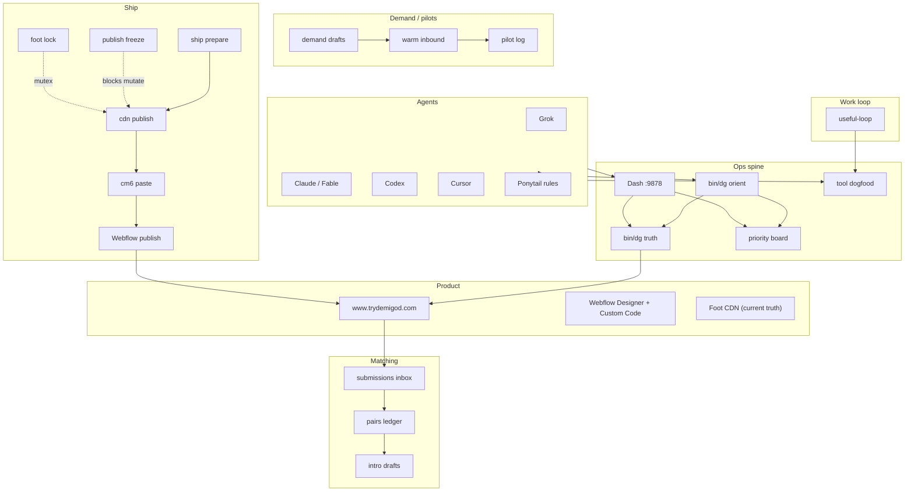
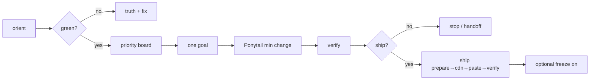
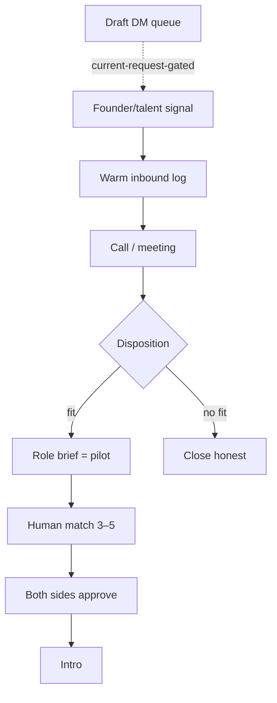

# Demigod — total workflow & processes

Comprehensive process map for ops, site ship, demand, matching, and agents.  
View in dash: **SF Map** tab · API `/api/maps/workflow`.

---

## 1. Big picture



---

## 2. Daily session process



---

## 3. Website request path

See also: `docs/DEMIGOD-WEBSITE-ARCHITECTURE-DIAGRAM.md`

```
Browser → Webflow HTML
  → Head custom (unhide, scrub, CSS)
  → Body (layout, modals, forms)
  → Footer (redirects + CDN foot JS)
  → foot-core: WIZ · board · ?p= pages
  → Form POST → Webflow store/email
```

---

## 4. Demand / pilot process



**Rules:** drafts only · warm ≠ pilot · no invented receipts · outbound sends are current-request-gated.

---

## 5. Agent collaboration process

| Stage | Who | Output |
|-------|-----|--------|
| Plan | Fable/Claude | Spec, files, risks |
| Execute | Grok/Cursor | Diffs + gate stdout |
| Review | Codex | PASS/BLOCK |
| Authorize | Current user request | Freeze, publish, outbound messages, money |

Always: **Ponytail** · dogfood wraps · no concurrent thrash loops.

---

## 6. Tool dogfood process

```
Use tool via: node demigod-tool-dogfood.mjs wrap --tool=NAME -- <cmd>
  → jsonl event (ok, ms, why)
  → /api/dogfood status
  → suggestions: reliability / usefulness / unused
  → improve or demote tool
```

---

## 7. Control plane modules

site · events · webflow · match · review · hygiene · ponytail · **workloop** · ship · orca · plans

---

## 8. Success metrics (honest)

| Metric | Target signal |
|--------|----------------|
| Truth green | disk==live foot, shipped |
| Pilots | real briefs only (0 is honest) |
| Warm overdue | 0 |
| Drafts ready | hygiene ok |
| Dogfood | tools used + low fail rate |
