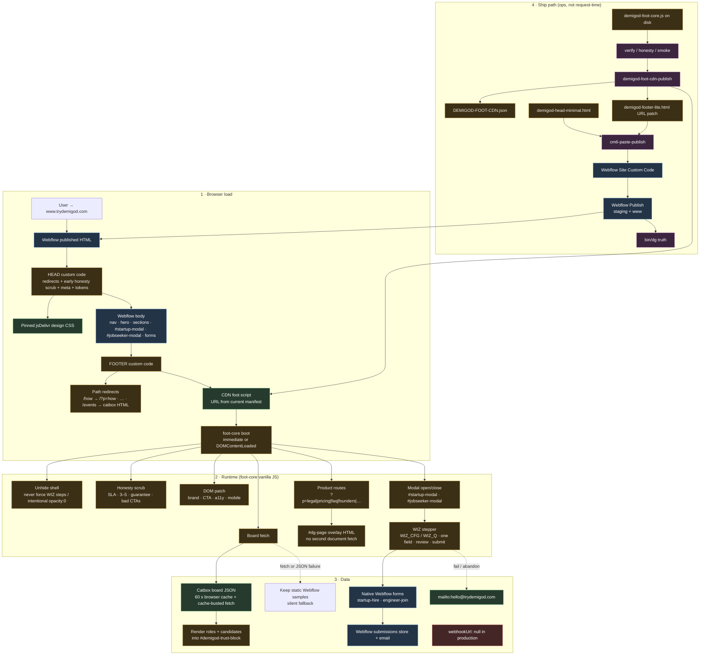
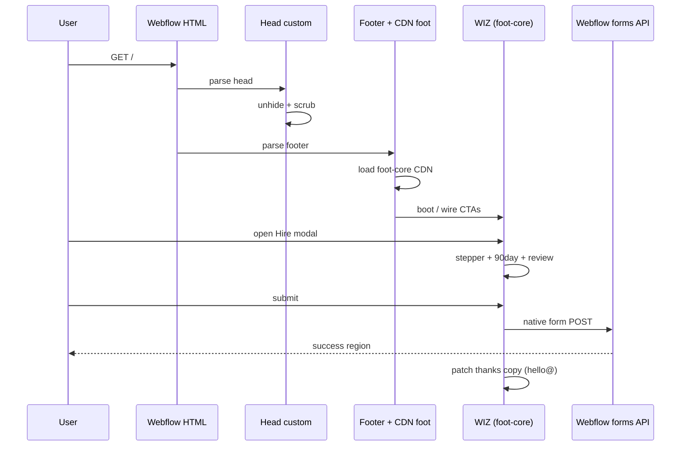

# Demigod website — runtime and ship architecture

**Purpose:** Full mental model of **trydemigod.com** for production comparison.  
**Sources:** `demigod-head-minimal.html`, `demigod-footer-lite.html`, `demigod-foot-core.js`, `DEMIGOD-FOOT-CDN.json`, live HTML probe. Current release identity comes only from `bin/dg truth`.

---

## A. Ownership split (read this first)

| Layer | Owner | What it is |
|-------|--------|------------|
| Hosting / HTML shell | **Webflow** | Published page, nav, hero, sections, modal shells, native form fields |
| Custom code HEAD | **Demigod disk** → pasted | Unhide, meta/OG, scrub early, design CSS link, tokens |
| Custom code FOOTER | **Demigod disk** → pasted | Path redirects + one CDN `<script>` for foot-core |
| Site behavior | **Demigod foot JS** (CDN) | WIZ, board, product pages `?p=`, CTA rewires, honesty scrubs |
| Design CSS | **Catbox CDN** | `files.catbox.moe/cycbs6.css` (from head) |
| Board ledger JSON | **Catbox CDN** | `files.catbox.moe/orqkmx.json` (hardcoded in foot-core) |
| Form transport | **Webflow** | Native form POST; email notifications; done/fail UI |
| Webhooks | **None in production** | Manifest `webhookUrl: null` |

---

## B. Master diagram (runtime + ship)



---

## C. Load sequence (numbered)

1. Browser requests **https://www.trydemigod.com/**
2. **Webflow** returns full HTML (Designer canvas + assets + interactions)
3. **HEAD custom code** runs early:
   - Critical CSS unhide (finite ticks, **no** MutationObserver thrash)
   - Early copy scrub script
   - Meta / OG / JSON-LD / theme tokens
   - Link to design CSS on Catbox
4. Body paints Webflow shell (often FOUC-guarded until unhide)
5. **FOOTER custom code**:
   - Tiny IIFE: pretty paths (`/pricing` → `/?p=pricing`, etc.)
   - **One** script: `id=demigod-foot-cdn-loader` → versioned CDN URL
6. CDN returns the current foot-core; `bin/dg truth` owns its version and body identity.
7. Boot runs immediately, on `DOMContentLoaded`, and at 400/1500 ms. The guarded patch pass is repeatable: scrub → patch DOM → wire CTAs/modals → WIZ enhance → board fetch → optional `?p=` overlay
8. User opens **Hire** / **Join** → modal + WIZ stepper over native fields
9. Submit → **Webflow form POST** (not our Node server)
10. Success UI from Webflow + Demigod thanks copy patch

---

## D. WIZ / forms path

```
CTA click
  → open #startup-modal | #jobseeker-modal
  → enhanceWIZ() wraps native .w-form fields
  → WIZ_CFG steps (startup includes required 90day-outcome + explicit review/__submit__)
  → optional localStorage draft (consent-gated)
  → native submit (startup-hire | engineer-join)
  → Webflow stores submission + emails site owner
  → done/fail regions; Demigod rewrites follow-up copy (hello@)
```

| Flow | Modal | Form name (Webflow) | Key fields |
|------|--------|---------------------|------------|
| Startup hire | `#startup-modal` | `startup-hire` | contact-email, company, role, stack, **90day-outcome** |
| Talent join | `#jobseeker-modal` | `engineer-join` | full-name, seeker-email, linkedin, skills, sf-bay |
| Partner | No live modal/form traced | Config only in `WIZ_CFG`; product page points to email | partner-* (dormant) |

**Not production:** local submissions webhook on `:9877` is for agent tests only.

---

## E. Product pages (`?p=`)

Footer redirects pathnames → query, then foot-core renders **in-page overlay** (same document):

`legal · partners · how · pricing · faq · founders · candidates · fees · security · sample · network · hire · talent · contact · compare · pilot · about · status`  
`/events` → external Catbox HTML (not SPA).

---

## F. Board

```
foot-core BOARD_CDN = https://files.catbox.moe/orqkmx.json
  → reuse in-memory data for 60s; otherwise fetch with minute cache-buster
  → normalize sample flags from realRoles
  → render roles / candidates only when #demigod-trust-block exists
  → on fetch/JSON failure, keep the static Webflow samples (no visible error)
```

Honesty policy lives in ops (`demigod-verify-board-honesty`) + publish of board JSON — not in Webflow Designer.

---

## G. Ship vs runtime (side by side)

| | **Runtime (visitor)** | **Ship (agent/human)** |
|--|----------------------|-------------------------|
| Input | Published Webflow HTML + CDN JS | Disk sources |
| Mutates | DOM only (browser) | CDN files, Webflow custom code, publish |
| Gate | Unhide + scrub success | verify-source, honesty, truth |
| Failure | Spinner / blank / WIZ broken | Disk≠live, freeze, lock, MIME |

```
disk foot-core ──publish CDN──► current manifest URL
disk footer-lite ──cm6 paste──► Webflow footer custom code
disk head-minimal ──cm6 paste──► Webflow head custom code
Webflow Publish ──► live HTML that points at CDN
truth ──► disk sha/version == live loader URL + body
```

---

## H. Sequence diagram (one happy path: hire brief)



---

## I. Where this model may disagree with “what you see”

Use this checklist against live (DevTools → Elements / Network):

| # | If true in production… | Means drift from this diagram |
|---|------------------------|--------------------------------|
| 1 | Head missing `dg-path-redirects` / `dg-base-tokens` | Stale head paste or double/corrupt custom code |
| 2 | Footer loader URL/body differs from `bin/dg truth` | Footer paste or CDN publish lag vs `DEMIGOD-FOOT-CDN.json` |
| 3 | Two+ foot loaders or no `demigod-foot-cdn-loader` | Broken footer / double paste |
| 4 | Modals lack `startup-hire` / field names WIZ expects | Designer form rename vs foot-core selectors |
| 5 | Board unchanged, empty, or wrongly labeled | Catbox fetch/JSON failed silently, trust block is absent, or `orqkmx.json` drifted from intended board honesty |
| 6 | Form goes nowhere / no email | Webflow form notification settings (not in foot JS) |
| 7 | Endless spinner | Doubled/corrupt custom code or CSS never applied (CDN fail path) |
| 8 | `/pricing` 404 without redirect | Footer redirect IIFE missing (old footer paste) |
| 9 | Live truth FAIL while site “looks fine” | CDN fetch/MIME flake (mitigated in truth) or real body mismatch |
| 10 | webhook hits your server | Something configured outside manifest (`webhookUrl: null`) |

---

## J. Artifact sources

| File | Role |
|------|------|
| `/tmp/dg-busy/website-architecture-codex.md` | Codex full mermaid draft |
| `docs/DEMIGOD-WEBSITE-ARCHITECTURE-DIAGRAM.md` | **This merged map** |
| `docs/DEMIGOD-RESOURCES-AND-WORKFLOWS-MAP.md` | Ops/tools map (not browser runtime) |
| Live probe | curl `trydemigod.com` + `bin/dg truth` |


---

## K. Minimal ASCII overview

```
┌─────────────────────────────────────────────────────────────┐
│                     Webflow (published)                     │
│  ┌─────────────┐  ┌──────────────────┐  ┌────────────────┐ │
│  │ Head custom │  │ Body: layout,    │  │ Footer custom  │ │
│  │ unhide+meta │  │ modals, forms    │  │ redirects+CDN  │ │
│  └──────┬──────┘  └────────┬─────────┘  └───────┬────────┘ │
└─────────┼──────────────────┼────────────────────┼──────────┘
          │                  │                    │
          ▼                  ▼                    ▼
     Catbox CSS         Native forms         Foot JS CDN
                             │               (statically)
                             ▼                    │
                      Webflow email store         │
                                                  ▼
                                    WIZ · board · ?p= pages · scrub
                                                  │
                                                  ▼
                                    Catbox board JSON (orqkmx)
```
